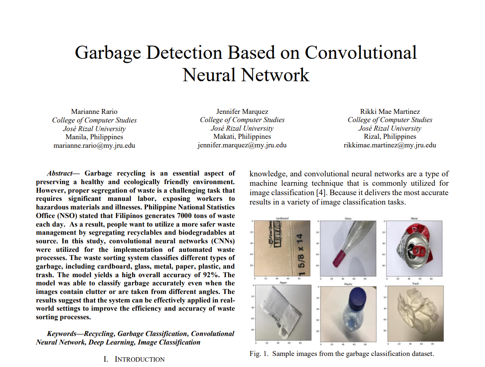
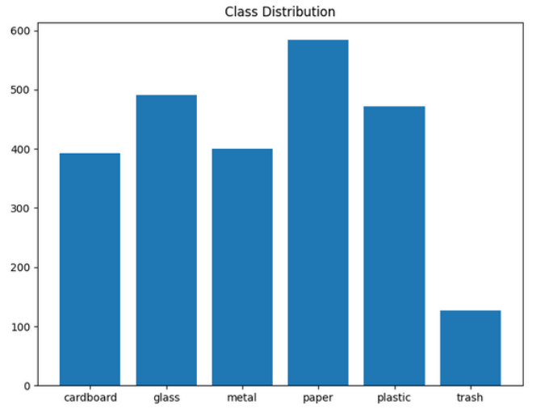
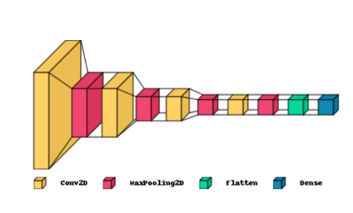
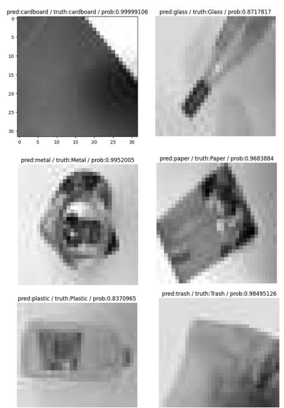

# Garbage Detection Based on Convolutional Neural Network
Final project for an application of machine learning and deep learning course (ITC C508). The code has been made available as a reference if anyone would like to reproduce the results of this project.

```Please cite this  project if this repository is useful for your research.```

Recycling trash is a crucial part of protecting our environment. Garbage must be divided into categories with similar recycling processes in order to enable the recycling process. The percentage of recycled waste can rise considerably if it is possible to separate domestic trash into several categories. Using the classes given, we trained the model in this notebook to categorize the input images and output the trash classification.

## Project Overview

* The objective of this study is to train the model to be able to predict the input images and classify it into one of the
garbage recycling categories, which includes cardboard, glass, metal, paper, plastic, trash.
* The CNN generated an accuracy score of ```92.96%``` which proved that this model has a potential to be used  a a tool for 
predicting garbage clases.
* Dataset includes cardboard(393), glass(491), metal(400), paper(584), plastic(472), trash(127)



## Built with
* Python
* Jupyter Notebook

## Getting started
To get the local copy of this repository, please run the following commands on your terminal:

```git clone https://github.com/PizaaRiaaa/Synapse.git```

* Read fullpaper: [click here](fullpaper/Final-Paper_Semaphore.pdf)
* locate original images: [click here](Garbage/original_images)
* locate processed images: [click here](Garbage/processed_images)

## Libraries
* tensorflow
* Sequential
* keras.layers
* ImageDataGenerator
* sklearn.metrics
* keras
* PIL
* pathlib
* scipy
* os
* numpy
* matplotlib.pyplot
* torchvisio.datasets
* torchvision.transform

## Data Preprocessing
Steps that were applied for the data preprocessing for all the images in the dataset. 
Each step is decribed below:
* ```Step 1:``` Resized all the images in the dataset to 32x32 pixel to match the input layer of the model
* ```Step 2:``` Converted all the images to grayscale to simplify the model's algorithm and computational requirements
* ```Step 3:``` Normalized image dataset by dividing each pixel value to 255.The pixel value ranges from 0 to 255 for each the
channels (RGB). Dividing it by 255 is necessary to normalize it to 0 to 1 range.
* ```Step 4:``` Flatten all the images into a vector matrix
* ```Step 5:``` Shuffled the train dataset for equal distribution of the data for splitting
* ```Step 6:``` Split the data into three sets - train, test, and validation. This is undergone to avoid data overfitting and to increase the model accuracy score

```CNN graph architecture based on the compiled model```


## Traning the model by using the train dataset
Epoch 1/60
52/52 [==============================] - 17s 318ms/step - loss: 1.7310 - accuracy: 0.2291 - val_loss: 1.7209 - val_accuracy: 0.2467
Epoch 2/60
52/52 [==============================] - 6s 107ms/step - loss: 1.7051 - accuracy: 0.2598 - val_loss: 1.6693 - val_accuracy: 0.2349
Epoch 3/60
52/52 [==============================] - 4s 85ms/step - loss: 1.6228 - accuracy: 0.2892 - val_loss: 1.5717 - val_accuracy: 0.3482
Epoch 4/60
52/52 [==============================] - 5s 96ms/step - loss: 1.5400 - accuracy: 0.3636 - val_loss: 1.5166 - val_accuracy: 0.3449
Epoch 5/60
52/52 [==============================] - 5s 93ms/step - loss: 1.4760 - accuracy: 0.3879 - val_loss: 1.4331 - val_accuracy: 0.4297
Epoch 6/60
52/52 [==============================] - 5s 91ms/step - loss: 1.4269 - accuracy: 0.4342 - val_loss: 1.3399 - val_accuracy: 0.4749
Epoch 7/60
52/52 [==============================] - 5s 92ms/step - loss: 1.3674 - accuracy: 0.4600 - val_loss: 1.3171 - val_accuracy: 0.4760
Epoch 8/60
52/52 [==============================] - 5s 91ms/step - loss: 1.3747 - accuracy: 0.4561 - val_loss: 1.2554 - val_accuracy: 0.5385
Epoch 9/60
52/52 [==============================] - 5s 92ms/step - loss: 1.2953 - accuracy: 0.4943 - val_loss: 1.2450 - val_accuracy: 0.5167
Epoch 10/60
52/52 [==============================] - 5s 90ms/step - loss: 1.2335 - accuracy: 0.5361 - val_loss: 1.1797 - val_accuracy: 0.5469
Epoch 11/60
52/52 [==============================] - 5s 92ms/step - loss: 1.1972 - accuracy: 0.5508 - val_loss: 1.1494 - val_accuracy: 0.5731
Epoch 12/60
52/52 [==============================] - 4s 86ms/step - loss: 1.1498 - accuracy: 0.5658 - val_loss: 1.1558 - val_accuracy: 0.5714
Epoch 13/60
...
Epoch 59/60
52/52 [==============================] - 4s 75ms/step - loss: 0.2195 - accuracy: 0.9278 - val_loss: 0.1807 - val_accuracy: 0.9526
Epoch 60/60
52/52 [==============================] - 4s 76ms/step - loss: 0.2202 - accuracy: 0.9296 - val_loss: 0.2046 - val_accuracy: 0.9308

## Results
The image below shows the results by comparing predictions with the original garbage labels. As can be seen, all images were correctly predicted. The image classfied as ```cardboard``` has the probability of ```99%```, ```glass 87%```, ```metal 99%```, ```paper 96%```, ```plastic 83%```, and ```trash with 98%```.



## License
This project is [MIT](LICENSE) Licensed
